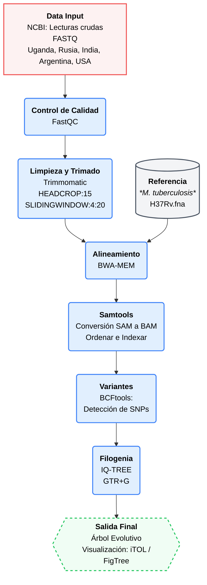

# Proyecto: Metagenomic DNA sequencing to quantify *Mycobacterium tuberculosis* DNA and diagnose tuberculosis  
## Integrantes  
*Pérez Laura  
*Mindiola Edwar  
*Baquedano Genesis  
*Guzman Genesis  

## Objetivo
Realizar un análisis comparativo de variantes genómicas en muestras de *Mycobacterium tuberculosis* obtenidas de cohortes geográficamente diversas (Uganda, Rusia ,India, Argentina y EE. UU.), con el fin de reconstruir su historia evolutiva mediante filogenia.  

## Dataset
datasets download genome accession GCF_000195955.2 --include gff3,rna,cds,protein,genome,seq-report (genome reference)  
Datasets de pacientes ubicados en diversos países y regiones, incluyendo Uganda, Argentina y la India, así como en ciudades y estados específicos como Moscú, San Petersburgo y Texas.

Paciente ubicación Uganda: SRR38304207  
Paciente ubicación Moscú: SRR38388669  
Paciente ubicación San Petersburgo: SRR26387480  
Paciente ubicación India: SRR36403484  
Paciente ubicación Argentina: SRR38405735  

## Flujo de Trabajo

## Resultados  
## Bibliografía
Doughty, E. L., Sergeant, M. J., Adetifa, I., Antonio, M., Pallen, M. J., & Clark, T. G. (2022). *Metagenomic DNA sequencing to quantify Mycobacterium tuberculosis DNA and diagnose tuberculosis*. Scientific Reports, 12, 17937. https://doi.org/10.1038/s41598-022-21244-x 
## Contribucion individual
##  Cómo reproducir (scripts)
