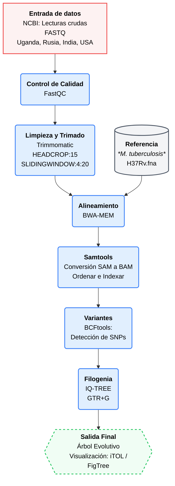

# Proyecto: Metagenomic DNA sequencing to quantify *Mycobacterium tuberculosis* DNA and diagnose tuberculosis  
## Integrantes  
* Pérez Laura  
+ Mindiola Edwar  
- Baquedano Genesis  
* Guzman Genesis  

## Objetivo
Realizar un análisis comparativo de variantes genómicas en muestras de *Mycobacterium tuberculosis* obtenidas de cohortes geográficamente diversas (Uganda, Rusia ,India y EE. UU.), con el fin de reconstruir su historia evolutiva mediante filogenia.  

## 1. Introducción
La tuberculosis (TB) es una de las enfermedades más antiguas y mortales, causada por el bacilo *Mycobacterium tuberculosis* (Mtb) que afecta a nivel mundial principalmente a migrantes, personas privadas de la libertad, personas que se encuentran en las fronteras y los países de ingresos bajos y medios. En la actualidad la TB constituye la segunda causa de muerte por un solo agente infeccioso tras la COVID-19. Por lo tanto, la tuberculosis es una enfermedad infecciosa  de salud pública a nivel mundial. La capacidad de esta bacteria para adaptarse y presentar variaciones genéticas entre distintas poblaciones ha despertado gran interés en el área de la bioinformática y la genómica comparativa. El estudio de variantes genómicas permite comprender mejor la diversidad genética del microorganismo, así como sus procesos de evolución y dispersión en diferentes regiones geográficas.

Actualmente, las herramientas bioinformáticas y los análisis filogenéticos facilitan la comparación de secuencias genómicas provenientes de distintas muestras, permitiendo identificar relaciones evolutivas entre cepas bacterianas. Este tipo de análisis resulta relevante para comprender cómo ciertas variantes pueden estar asociadas a procesos de transmisión, adaptación o diferencias epidemiológicas entre países.

En este proyecto se realizará un análisis comparativo de variantes genómicas en muestras de *Mycobacterium tuberculosis* provenientes de Uganda, Rusia ,India, Argentina y EE. UU.. Mediante herramientas de análisis filogenético y comparación genómica, se buscará reconstruir la historia evolutiva de estas cepas y comprender la relación genética existente entre muestras obtenidas en distintas regiones del mundo.  

## 2. Planteamiento del problema 
La tuberculosis sigue siendo una de las enfermedades infecciosas con mayor impacto global, y la diversidad genética de *Mycobacterium tuberculosis* representa un reto para comprender su evolución y propagación. Las diferencias genómicas presentes entre cepas aisladas en distintas regiones geográficas pueden influir en su comportamiento biológico, transmisión y adaptación, lo que hace necesario realizar estudios comparativos que permitan identificar relaciones evolutivas entre ellas.

A pesar de los avances en secuenciación y análisis genómico, todavía existen limitaciones para comprender cómo las variantes genéticas de *Mycobacterium tuberculosis* se distribuyen y evolucionan entre diferentes poblaciones humanas. Por ello, resulta importante comparar muestras provenientes de países y regiones, como: Uganda, Argentina y la India, así como en ciudades y estados específicos como Moscú, San Petersburgo y Texas, mediante herramientas bioinformáticas y análisis filogenéticos que permitan reconstruir su historia evolutiva y analizar la diversidad genética de este microorganismo.

## 3. Metodología  
El análisis bioinformático se inició con un riguroso control de calidad de las lecturas crudas en formato FASTQ mediante FastQC, seguido de un procesamiento masivo con Trimmomatic empleando el parámetro HEADCROP:15 para eliminar sesgos de composición en el inicio de las secuencias, además de filtros de calidad por ventana deslizante (SLIDINGWINDOW:4:20). Las lecturas filtradas se alinearon contra el genoma de referencia de Mycobacterium tuberculosis H37Rv utilizando el algoritmo BWA-MEM. Tras el procesamiento de los archivos de alineamiento con Samtools, se procedió a la identificación de polimorfismos de nucleótido único (SNPs) mediante BCFtools. Finalmente, a partir de la matriz de variantes obtenida, se realizó la reconstrucción filogenética por el método de Máxima Verosimilitud utilizando IQ-TREE con 1000 réplicas de bootstrap, permitiendo así la inferencia de las relaciones evolutivas y la estructura poblacional de las muestras provenientes de las cinco cohortes geográficas en estudio y la cepa de referencia. Por último, se visualizó el árbol evolutivo en MegaX.  

**Figura 1**
Diagrama de flujo de metodologìa

## 4. Resultados  

En las figuras 2 y 3,se obtuvo un reporte comparativo de MultiQC de las cinco distintas muestras geograficas, mismo en el que se observó una mejora significativa en la integridad de los datos genòmicos de *Mycobacterium Tuberculosis* tras el procesamiento con Trimmomatic. En los datos crudos se observaron tasas de error (% Failed) de hasta el 36% (SRR36403484), las cuales se redujeron a un 18% tras retirar bases de baja calidad y adaptado. El porcentaje de Guanina-Citosina (%GC) se mantuvo entre un rango de 64% y 66% caracterìstico de esta cepa. Además, se redujeron las longitudes promedio de las lecturas luego de su procesamiento evidenciando una limpieza selectiva de los extremos 3' resultando en un porcentaje mínimo de lecturas eliminadas lo que garantiza una cobertura robusta para el análisis filogenético. Por último, se observó una variabilidad significativa en los niveles de duplicación de secuencias (% Dups), oscilando desde un 10.5% hasta un 81.8% en la muestra SRR36403484.  

**Figura 2**    
Reporte de MultiQC de secuencias crudas de *Mycobacterium Tuberculosis*     
    
**Figura 3**  
Reporte de MultiQC de secuencias reprocesadas en Trimmomatic de *Mycobacterium Tuberculosis*  
   

En la figura 4 y 5, se observó la comparativa la calidad entre los datos crudos y procesados de una de las muestras SRR26387480 donde se evidenció una optimización de lecturas, y que el valor de calidad Phred se mantiene por encima de Q30 garantizando una identificación de nucleótidos superior al 99.9%.    

**Figura 4**  
Reporte de calidad FastQC de una secuencia cruda  
  
**Figura 5**  
Reporte de calidad FastQC de una secuencia sometida a Trimmomatic  
  

En la figura 6 y 7, se observa el contenido de secuencias por base antes y despues de Trimmomatic, evidenciando un cambio significativo tras su procesamiento al existir fluctuaciones en los primeros 15 nucleótidos y al final obteniendo proporciones de bases constantes y paralelas a lo largo de la lectura obteniendo así datos libres de ruidos para su posterior alineamiento.  

**Figura 6**    
Contenido de secuencia por base de una secuencia cruda    
  
**Figura 7**  
Contenido de secuencia por base de una secuencia sometida a Trimmomatic    
    

En la figura 8, se obtuvo en el árbol filogenético un clado sólido con valor de bootstrap de 100 que incluye las muestras de San Petersburgo, Uganda y Texas. Mientras que, las muestras de Moscú e India tienen un valor de 63 lo que sugiere una incertidumbre estadística. Además, se observa que las muestras más emparentadas son San Petersburgo y Texas al compartir un nodo común. A su vez, se observó que Uganda tiene la rama horizontal más larga lo que sugiere una mayor cantidad de variaciones genéticas respecto al ancestro común. En tanto que, Moscú e India tienen ramas muy cortas y cercanas al eje principal lo que indica que son más similares genéticamente a la cepa ancestral.   

**Figura 8**  
Árbol Filogenético de *Mycobacterium Tuberculosis*  
  

## 5. Discusión  
*por si les sirve para discu el porque las fluctuaciones al inicio de las secuencias: En los datos crudos, se observan fluctuaciones pronunciadas en los primeros 10 nucleótidos y un desbalance abrupto al final de la lectura (posición 110 bp), lo cual es indicativo de la presencia de adaptadores y sesgos técnicos de la secuenciación.*
## 6. Conclusiones  
## 7. Referencias bibliográficas  
Doughty, EL, Sergeant, MJ, Adetifa, I., Antonio, M., Pallen, MJ y Clark, TG (2022). Secuenciación de ADN metagenómico para cuantificar el ADN de Mycobacterium tuberculosis y diagnosticar la tuberculosis . Scientific Reports, 12, 17937. https://doi.org/10.1038/s41598-022-21244-x 
