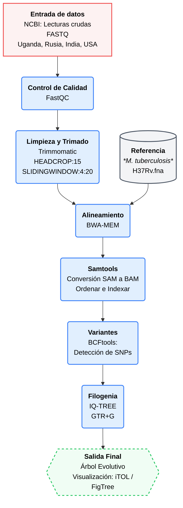

# Proyecto: Metagenomic DNA sequencing to quantify *Mycobacterium tuberculosis* DNA and diagnose tuberculosis  
## Integrantes  
* Pérez Laura  
+ Mindiola Edwar  
- Baquedano Genesis  
* Guzman Genesis  

## Objetivo
Realizar un análisis comparativo de variantes genómicas en muestras de *Mycobacterium tuberculosis* obtenidas de cohortes geográficamente diversas (Uganda, Rusia ,India y EE. UU.), con el fin de reconstruir su historia evolutiva mediante filogenia.  

## 1. Introducción
La tuberculosis (TB) es una de las enfermedades más antiguas y mortales, causada por el bacilo *Mycobacterium tuberculosis* (Mtb) que afecta a nivel mundial principalmente a migrantes, personas privadas de la libertad, personas que se encuentran en las fronteras y los países de ingresos bajos y medios. En la actualidad la TB constituye la segunda causa de muerte por un solo agente infeccioso tras la COVID-19. Por lo tanto, la tuberculosis es una enfermedad infecciosa  de salud pública a nivel mundial. La capacidad de esta bacteria para adaptarse y presentar variaciones genéticas entre distintas poblaciones ha despertado gran interés en el área de la bioinformática y la genómica comparativa. El estudio de variantes genómicas permite comprender mejor la diversidad genética del microorganismo, así como sus procesos de evolución y dispersión en diferentes regiones geográficas.

Actualmente, las herramientas bioinformáticas y los análisis filogenéticos facilitan la comparación de secuencias genómicas provenientes de distintas muestras, permitiendo identificar relaciones evolutivas entre cepas bacterianas. Este tipo de análisis resulta relevante para comprender cómo ciertas variantes pueden estar asociadas a procesos de transmisión, adaptación o diferencias epidemiológicas entre países.

En este proyecto se realizará un análisis comparativo de variantes genómicas en muestras de *Mycobacterium tuberculosis* provenientes de Uganda, Rusia ,India, Argentina y EE. UU.. Mediante herramientas de análisis filogenético y comparación genómica, se buscará reconstruir la historia evolutiva de estas cepas y comprender la relación genética existente entre muestras obtenidas en distintas regiones del mundo.  

## 2. Planteamiento del problema 
La tuberculosis sigue siendo una de las enfermedades infecciosas con mayor impacto global, y la diversidad genética de *Mycobacterium tuberculosis* representa un reto para comprender su evolución y propagación. Las diferencias genómicas presentes entre cepas aisladas en distintas regiones geográficas pueden influir en su comportamiento biológico, transmisión y adaptación, lo que hace necesario realizar estudios comparativos que permitan identificar relaciones evolutivas entre ellas.

A pesar de los avances en secuenciación y análisis genómico, todavía existen limitaciones para comprender cómo las variantes genéticas de *Mycobacterium tuberculosis* se distribuyen y evolucionan entre diferentes poblaciones humanas. Por ello, resulta importante comparar muestras provenientes de países y regiones, como: Uganda, Argentina y la India, así como en ciudades y estados específicos como Moscú, San Petersburgo y Texas, mediante herramientas bioinformáticas y análisis filogenéticos que permitan reconstruir su historia evolutiva y analizar la diversidad genética de este microorganismo.

## 3. Metodología  
El flujo de análisis genómico comenzó con la evaluación de calidad de las lecturas crudas en formato FASTQ mediante FastQC. Posteriormente, la limpieza de los datos se realizó con Trimmomatic, aplicando un recorte en el extremo 5' HEADCROP:15 para eliminar sesgos de composición iniciales, acompañado de un filtro por ventanas deslizantes SLIDINGWINDOW:4:20. Las lecturas de alta calidad resultantes fueron mapeadas contra el genoma de referencia de Mycobacterium tuberculosis cepa de referncia  H37Rv utilizando el algoritmo BWA-MEM. Estos alineamientos fueron ordenados, indexados y convertidos a formato BAM mediante Samtools, preparando los datos para el llamado de polimorfismos de nucleótido único (SNPs) a través de BCFtools. Con la matriz de variantes generada, se llevó a cabo la reconstrucción filogenética por Inferencia de Máxima Verosimilitud en IQ-TREE, aplicando el modelo de sustitución GTR+G y un soporte de 1000 réplicas de bootstrap. Esto permitió establecer las relaciones evolutivas entre las cohortes geográficas y la cepa de referencia. Finalmente, la visualización y edición del árbol evolutivo se realizó en Mega12

**Figura 1**
Diagrama de flujo de metodología

## 4. Resultados  

En las figuras 2 y 3,se obtuvo un reporte comparativo de MultiQC de las cinco distintas muestras geograficas, mismo en el que se observó una mejora significativa en la integridad de los datos genòmicos de *Mycobacterium Tuberculosis* tras el procesamiento con Trimmomatic. En los datos crudos se observaron tasas de error (% Failed) de hasta el 36% (SRR36403484), las cuales se redujeron a un 18% tras retirar bases de baja calidad y adaptado. El porcentaje de Guanina-Citosina (%GC) se mantuvo entre un rango de 64% y 66% caracterìstico de esta cepa. Además, se redujeron las longitudes promedio de las lecturas luego de su procesamiento evidenciando una limpieza selectiva de los extremos 3' resultando en un porcentaje mínimo de lecturas eliminadas lo que garantiza una cobertura robusta para el análisis filogenético. Por último, se observó una variabilidad significativa en los niveles de duplicación de secuencias (% Dups), oscilando desde un 10.5% hasta un 81.8% en la muestra SRR36403484.  

**Figura 2**    
Reporte de MultiQC de secuencias crudas de *Mycobacterium Tuberculosis*     

    

**Figura 3**  
Reporte de MultiQC de secuencias reprocesadas en Trimmomatic de *Mycobacterium Tuberculosis*  

   

En la figura 4 y 5, se observó la comparativa la calidad entre los datos crudos y procesados de una de las muestras SRR26387480 donde se evidenció una optimización de lecturas, y que el valor de calidad Phred se mantiene por encima de Q30 garantizando una identificación de nucleótidos superior al 99.9%.    

**Figura 4**  
Reporte de calidad FastQC de una secuencia cruda  

  

**Figura 5**  
Reporte de calidad FastQC de una secuencia sometida a Trimmomatic  

  

En la figura 6 y 7, se observa el contenido de secuencias por base antes y despues de Trimmomatic, evidenciando un cambio significativo tras su procesamiento al existir fluctuaciones en los primeros 15 nucleótidos y al final obteniendo proporciones de bases constantes y paralelas a lo largo de la lectura obteniendo así datos libres de ruidos para su posterior alineamiento.  

**Figura 6**    
Contenido de secuencia por base de una secuencia cruda    

  

**Figura 7**  
Contenido de secuencia por base de una secuencia sometida a Trimmomatic    

    

En la figura 8, se obtuvo en el árbol filogenético un clado sólido con valor de bootstrap de 100 que incluye las muestras de San Petersburgo, Uganda y Texas. Mientras que, las muestras de Moscú e India tienen un valor de 63 lo que sugiere una incertidumbre estadística. Además, se observa que las muestras más emparentadas son San Petersburgo y Texas al compartir un nodo común. A su vez, se observó que Uganda tiene la rama horizontal más larga lo que sugiere una mayor cantidad de variaciones genéticas respecto al ancestro común. En tanto que, Moscú e India tienen ramas muy cortas y cercanas al eje principal lo que indica que son más similares genéticamente a la cepa ancestral.   

**Figura 8**  
Árbol Filogenético de *Mycobacterium Tuberculosis*  
  
## 5. Discusión  
El análisis de calidad posprocesamiento en las Figuras 3 y 5 evidencia una reducción en la longitud promedio de las lecturas. Sin embargo, esta pérdida de datos es un compromiso técnico (trade-off) necesario y beneficioso. Al emplear el filtrado por ventana deslizante SLIDINGWINDOW, se eliminaron selectivamente las colas 3' de baja calidad que típicamente decaen en los ciclos finales de la secuenciación. Mantener un valor Phred superior a Q30 garantiza una exactitud del 99.9% en la identificación de cada base. En el contexto de este estudio filogenético, esta rigurosidad es indispensable, puesto que la reconstrucción evolutiva depende de la identificación de polimorfismos de nucleótido único (SNPs) reales; una calidad inferior habría introducido falsos positivos biológicos.

La consistencia del porcentaje de Guanina-Citosina (64% - 66%) a través de todas las muestras analizadas actúa como un control de calidad biológico, dado que este rango es la firma genómica característica de *Mycobacterium tuberculosis*. Por otro lado, la alta variabilidad en los niveles de duplicación de secuencias alcanzando hasta un 81.8%, es un fenómeno técnico esperado en la secuenciación de genomas bacterianos pequeños sometidos a amplificación por PCR durante la generación de librerías. Aunque las lecturas duplicadas no afectan directamente la calidad base por base, este hallazgo subraya la necesidad de implementar pasos posteriores de desduplicación (como el uso de markdup en Samtools) antes de la llamada de variantes para evitar sesgos en la profundidad de cobertura (coverage).

Las fluctuaciones observadas en el contenido de bases de los primeros nucleótidos (Figura 6) son un sesgo de composición característico de las plataformas de secuenciación Illumina, frecuentemente asociado al uso de hexámeros aleatorios durante la preparación de la librería genómica. La decisión metodológica de aplicar el parámetro HEADCROP:15 en Trimmomatic (Figura 7) se justifica plenamente al lograr estabilizar la proporción de bases. Esto es un paso crítico, ya que mantener este ruido técnico en los extremos 5' habría provocado errores sistemáticos durante el alineamiento con BWA-MEM, reduciendo la tasa de mapeo contra el genoma de referencia de M. tuberculosis

El análisis filogenético evidenció diferencias en el grado de relación genética entre los aislados geográficos de Mycobacterium tuberculosis y la cepa de referencia H37Rv, lo que refleja distintos niveles de divergencia evolutiva acumulada en cada muestra.

Las secuencias provenientes de San Petersburgo y Texas se agruparon dentro de un mismo clado con un valor bootstrap de 100, indicando un soporte estadístico altamente confiable. Esta asociación sugiere que ambos aislados comparten un mayor número de características genéticas y posiblemente un origen evolutivo cercano. Además, la menor longitud de sus ramas en comparación con otras muestras indica una acumulación reducida de cambios nucleotídicos desde el ancestro común, lo que respalda su estrecha relación filogenética y una distancia evolutiva moderada respecto a H37Rv.

En contraste, la muestra de Uganda presentó la rama filogenética más extensa, indicando una mayor distancia genética dentro del árbol. Este comportamiento sugiere una acumulación más significativa de variaciones moleculares a lo largo del tiempo, lo que podría asociarse con procesos evolutivos independientes, presión selectiva regional o particularidades del linaje circulante en dicha zona geográfica. Aunque Uganda comparte un ancestro común con San Petersburgo y Texas, su separación dentro del árbol demuestra un proceso de divergencia más marcado.

Por otro lado, las muestras de Moscú e India se localizaron más próximas a la secuencia de referencia H37Rv, lo que indica una menor distancia evolutiva y una conservación genética relativamente mayor. Sin embargo, el soporte bootstrap de 63 asociado a este agrupamiento representa una confianza estadística moderada, por lo que la relación filogenética observada debe interpretarse con precaución. A pesar de ello, ambas muestras parecen mantener una similitud genética más cercana a la cepa ancestral en comparación con Uganda.

*por si les sirve para discu el porque las fluctuaciones al inicio de las secuencias: En los datos crudos, se observan fluctuaciones pronunciadas en los primeros 10 nucleótidos y un desbalance abrupto al final de la lectura (posición 110 bp), lo cual es indicativo de la presencia de adaptadores y sesgos técnicos de la secuenciación.*
## 6. Conclusiones  
La aplicación de filtros rigurosos de calidad (SLIDINGWINDOW) y la eliminación de sesgos de composición en los extremos 5' (HEADCROP:15) mediante Trimmomatic son pasos indispensables. Aunque implican una reducción en la longitud de las lecturas, garantizan una exactitud superior al 99.9% (Phred > Q30) y eliminan ruidos técnicos propios de Illumina. Esto asegura que los SNPs identificados posteriormente sean variaciones biológicas reales y no artefactos de secuenciación.

La constancia en el contenido de GC (64% - 66%) valida exitosamente la identidad biológica de todas las muestras analizadas como Mycobacterium tuberculosis. Asimismo, la detección de altas tasas de duplicación por PCR resalta la importancia de incluir protocolos de desduplicación en el flujo de trabajo para garantizar un análisis de cobertura preciso.

Una estrecha relación entre San Petersburgo y Texas concluye con un alto nivel de certeza estadística (Bootstrap 100) que los aislados de San Petersburgo y Texas comparten un ancestro evolutivo común y reciente, presentando una divergencia genética moderada y una alta similitud en sus perfiles mutacionales.

Alta divergencia en el linaje de Uganda, la cepa proveniente de Uganda representa el aislado con mayor distancia genética del estudio. La significativa acumulación de variaciones moleculares sugiere que este linaje ha experimentado un proceso de evolución independiente, posiblemente impulsado por presiones selectivas locales en su región de origen.

## 7. Referencias bibliográficas  
Doughty, EL, Sergeant, MJ, Adetifa, I., Antonio, M., Pallen, MJ y Clark, TG (2022). Secuenciación de ADN metagenómico para cuantificar el ADN de Mycobacterium tuberculosis y diagnosticar la tuberculosis . Scientific Reports, 12, 17937. https://doi.org/10.1038/s41598-022-21244-x 
